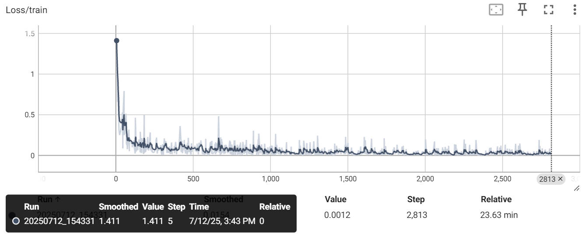

# Day 1 – 2025-07-11

> 项目：mnist_cpu
---

### 项目结构

> mnist_cpu/  
> ├── mycv/  
> │ ├── __init__.py  
> │ ├── datasets.py  
> │ ├── models.py  
> │ ├── trainer.py  
> │ └── utils.py  
> ├── scripts/  
> │ ├── train.py  
> │ ├── eval.py  
> │ └── infer_one.py  
> ├── tests/  
> ├── requirements.txt  
> └── README.md

---

### ✅ 今日完成清单

| 任务             | 状态 | 备注                              |
|----------------|------|---------------------------------|
| 搭建项目文件夹模板      | ✅ | `/mycv` `/scriots` `/tests` 已建好 |
| 完成通用Trainer类模板 | ✅ | 支持训练、验证、自动保存最优模型                |

---

# Day 2 - 2025-07-12

---

### ✅ 今日完成清单

| 任务                        | 状态 | 备注                     |
|---------------------------|------|------------------------|
| 编写`mycv/trianer`的Trainer类 | ✅ | 有了该类，只需要在`main`里调用即可   |
| 编写`mycv/datasets`         | ✅ | 用于加载数据集                |
| 编写`mycv/models`           |✅| 存放模型的文件，后续切换模型，只需要修改这里 |
| 编写`mycv/utils`            |✅| 放两个小工具：日志目录、断点保存/加载    |
| 改写`scripts/train.py`      |✅| 改写后调用，结果如下             |

```bash
python -m scripts.train --data mnist --epochs 3
```

### 问题记录
1. 使用 python scripts/train.py --data mnist --epochs 3默认将scripts当作工作区，将无法获取mycv模块  
解决办法 使用 python -m 则将你的工作区设置为你当前终端所在目录

---
# Day 3 ‑ 通用 Trainer、断点续训 & TensorBoard

> 日期：2025-07-12  
> 设备：单核 CPU

## ✅ 新增功能
| 功能 | 文件 | 备注 |
|---|---|---|
| 通用 Trainer | `mycv/trainer.py` | 训练/验证/日志一体化 |
| 断点续训 | `--resume ckpt/last.pth` | 支持 epoch / optimizer 状态恢复 |
| TensorBoard 日志 | `runs/YYYYMMDD_HHMMSS` | 实时 loss & acc 曲线 |
| 模型注册 | `mycv/models.py` | ResNet18 / MobileNet 一键切换 |

## 🏃‍♂️ 使用示例
### 1. 从头训练 3 epoch
```bash
python scripts/train.py --data mnist --epochs 3
```

# Day 4 — 推理落地：CLI + FastAPI + Docker

> 日期：2025-07-13  
> 设备：单核 CPU

## ✅ 今日成果
| 功能 | 文件 | 说明 |
|---|---|---|
| 单张推理 | `scripts/infer_one.py` | 命令行 `python infer_one.py test.png` |
| 批量推理 | `scripts/infer_batch.py` | 遍历文件夹输出所有预测 |
| HTTP 服务 | `scripts/serve.py` | FastAPI `/predict` 接口 |
| 单元测试 | `tests/test_predictor.py` | pytest 验证 3.png → 3 |
| Docker | `Dockerfile` | 一键容器化 |

## 🚀 快速体验

### 1. CLI 单张
```bash
python scripts/infer_one.py assets/3.png
# Predicted: 3  confidence: 0.997
```


---

# Day 5 — 量化加速：INT8 把模型压到 11 MB，推理再快 2.5×

> 日期：2025-07-13  
> 设备：单核 CPU

## ✅ 今日成果
| 步骤 | 文件 | 效果 |
|---|---|---|
| 量化导出 | `scripts/quantize_export.py` | 44 MB → 11 MB |
| 压测脚本 | `scripts/benchmark.py` | 自动输出延迟 & 吞吐 |
| 报告生成 | `results/benchmark.md` | 表格化对比 |

## 🔧 一键运行
```bash
# 1. 生成 INT8 权重
python scripts/quantize_export.py
# 输出：INT8 model saved -> ckpt/best_int8.pth  size=10.97 MB

# 2. 压测对比
python scripts/benchmark.py --ckpt ckpt/best.pth
python scripts/benchmark.py --ckpt ckpt/best_int8.pth --quantized

# 3. 查看报告
cat results/benchmark.md
```


---

# Day 6 — CI/CD：GitHub Actions 跑测试、自动量化、部署 Pages

> 日期：2025-07-13  
> 触发条件：每次 push / PR

## ✅ 流水线功能
| 阶段 | 工具 | 用途 |
|---|---|---|
| 环境 | ubuntu-latest + Python 3.10 | 与本地一致 |
| 测试 | pytest | 单元测试 & 覆盖率 |
| 训练 | CPU 训练 1 epoch | 验证脚本完整性 |
| 量化 | GitHub Actions 自动跑 | 生成 INT8 权重 |
| 报告 | GitHub Pages | 在线展示 benchmark 表格 |
| 徽章 | README CI badge | 绿色 ✔ 状态 |

## 🔧 文件一览
- `.github/workflows/ci.yml`（核心）
- `tests/test_trainer.py`（补充训练器测试）
- `docs/ci_report.md`（自动生成）

## 🚀 使用方法

### 1. 推送即触发
```bash
git add .
git commit -m "feat: xxx"
git push
```